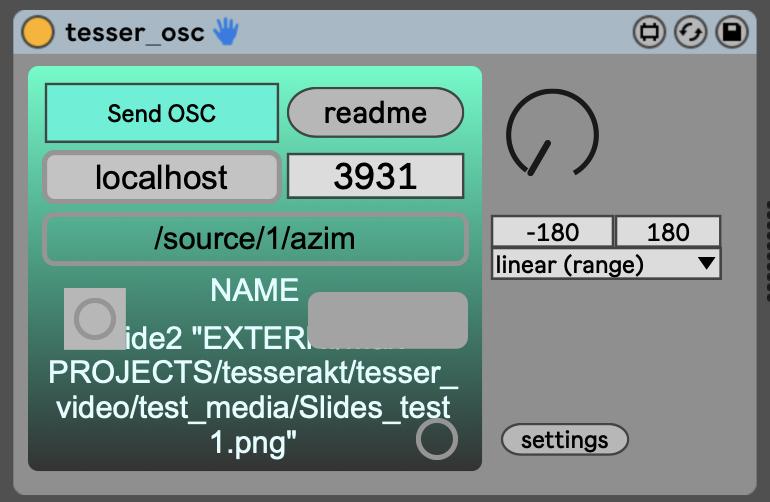

# tesser_OSCS (send)

This device sends out one stream of messages via OSC. It also alllows to store the OSC prefix and to scale the input value as needed.

## Download

[Download MaxForLive device](https://drive.google.com/file/d/1T4V706c3m_R70QNPdr7-R0fbvf4IchYn/view?usp=sharing)

---

## ISSUES

* It can only send out one stream of values. It is problematic if there are more than one controller!

* OSCpipe should help with that. (I keep this one as it is for backwards compatibility)
